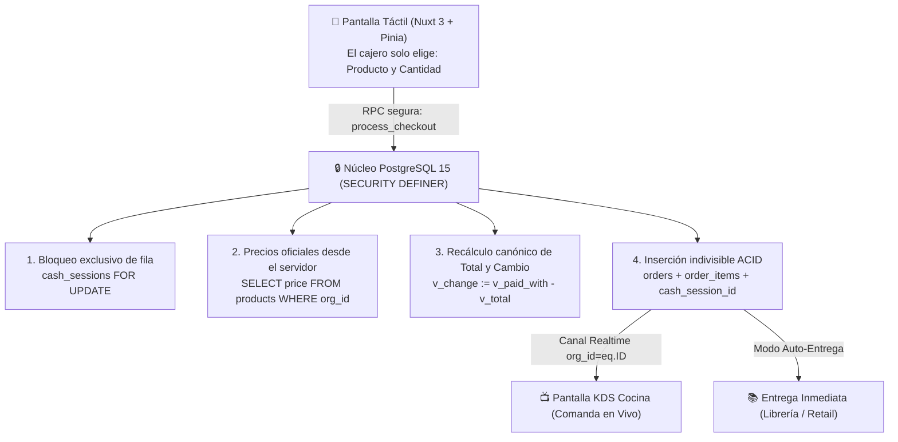

# AvivaCheck POS

### Punto de Venta Multi-Tenant y Pantalla de Cocina para Congregaciones y Comunidades

[](https://nuxt.com/)
[](https://supabase.com/)
[](https://www.postgresql.org/docs/current/ddl-rowsecurity.html)
[](https://playwright.dev/)

---

## 🕊️ Una Carta de Bienvenida: Por qué existe este proyecto

La administración financiera dentro de una iglesia o comunidad sin fines de lucro no es un ejercicio corporativo frío; es un acto de **mayordomía, cuidado mutuo y preservación de la confianza pública**.

Cuando una fila de cafetería se detiene en un domingo concurrido, o cuando un voluntario termina su turno de servicio con un descuadre inexplicable en el dinero, el daño no es meramente económico: se genera ansiedad en personas que están donando su tiempo con un corazón generoso y se desgasta la armonía del servicio.

**AvivaCheck POS nació para erradicar esa fricción.**

La ingeniería de alto nivel entra en escena no para presumir destreza técnica, sino para actuar como un **escudo protector silencioso**: un sistema que asume el trabajo matemático pesado, protege el dinero de la congregación con precisión milimétrica y le devuelve la serenidad a quienes sirven en el mostrador y a quienes lideran la iglesia.

---

## 🏛️ La Arquitectura al Servicio del Orden

El diseño de AvivaCheck POS está construido en dos capas simultáneas: **el beneficio humano visible** y **la ingeniería transaccional de bajo nivel**.



### Los 5 Blindajes del Sistema

#### 1. Precios protegidos desde el servidor (Zero-Trust Pricing)
* **En palabras sencillas:** La pantalla táctil del cajero no calcula ni decide el dinero final. La base de datos es la única autoridad que busca los precios oficiales fijados por el líder, suma los montos y calcula el cambio exacto.
* **Para la arquitectura:** Desconfianza total del cliente web. El frontend en Nuxt 3/Pinia envía únicamente una carga útil con tuplas de `product_id` y `quantity`. La función `process_checkout` en PostgreSQL consulta la tabla canónica de productos bajo el identificador del tenant, recalculando subtotales, totales y cambio (`paid_with - total`), anulando cualquier intento de manipulación en el cliente.

#### 2. Cobro seguro e indivisible (Atomicidad ACID en `process_checkout`)
* **En palabras sencillas:** Una venta se registra completa o no se registra nada. Jamás ocurrirá que se descuente dinero de una caja pero no se genere la orden, o que se envíe una comanda a cocina sin que el pago haya quedado debidamente asentado.
* **Para la arquitectura:** Encapsulamiento transaccional estricto en PostgreSQL mediante funciones ejecutadas con privilegios `SECURITY DEFINER` y `search_path = public`. La cabecera del pedido, sus líneas de detalle y la vinculación a la sesión de caja ocurren dentro de una sola frontera ACID. Cualquier inconsistencia provoca un `ROLLBACK` total automático.

#### 3. Cajas compartidas en orden estricto (Exclusión Mutua con Bloqueo de Fila)
* **En palabras sencillas:** Si dos voluntarios cobran en la misma caja física desde computadoras o celulares distintos, el sistema los atiende en fila india en una fracción de segundo, evitando que el dinero se sume dos veces o que los saldos se confundan.
* **Para la arquitectura:** Serialización pesimista en base de datos mediante la instrucción `SELECT * FROM cash_sessions WHERE id = v_session_id FOR UPDATE`. Esto bloquea temporalmente el registro de la sesión de caja para la transacción en curso, forzando a cualquier operación paralela a esperar la confirmación de la anterior y garantizando la integridad de los saldos acumulados.

#### 4. Cocina conectada en tiempo real (Canales KDS Aislados)
* **En palabras sencillas:** El equipo en cocina ve los pedidos aparecer en su pantalla en el mismo segundo en que se cobra en caja. Los alimentos van a la pantalla de cocina, mientras que las ventas de libros o materiales se entregan de inmediato en mostrador sin saturar a los cocineros.
* **Para la arquitectura:** Transmisión de eventos a través de Supabase Realtime filtrados por departamento y organización mediante el canal `kds:orders:${orgId}`. Los pedidos se despachan asíncronamente solo cuando la transacción ha hecho `COMMIT` en la base de datos. Los departamentos de tipo retail procesan órdenes con bandera `auto_accept_orders` sin pasar por la cola de confección.

#### 5. Espacios totalmente independientes (Row-Level Security Nativo)
* **En palabras sencillas:** Cada iglesia y cada área de servicio vive en su propia habitación cerrada con llave. Es matemáticamente imposible que una congregación vea por accidente las ventas, los productos o los miembros de otra.
* **Para la arquitectura:** Políticas de Row-Level Security (RLS) aplicadas en el motor de PostgreSQL vinculadas a la identidad de sesión de Supabase (`auth.uid()`). Las consultas no dependen de filtros manuales en el frontend; el motor de base de datos descarta cualquier fila que no coincida con el contexto organizacional del usuario.

---

## 📋 Módulos y Flujos Operativos Cotidianos

1. **Punto de Venta Táctil (`/page/POS/pointOfSales`):**
   * Catálogo visual optimizado para pantallas táctiles y celulares.
   * Selección rápida de artículos, desglose automático de cambio y emisión de tickets.
2. **Gestión de Cajas y Arqueos (`/page/POS/cashClosing`):**
   * Modalidades de **Caja Compartida** (múltiples cajeros en un mismo fondo) o **Caja Independiente**.
   * **Arqueo y Corte de Turno:** Comparación transparente entre efectivo contado en cajón y ventas esperadas.
   * **Pre-Cierre de Contingencia:** Rescate seguro de caja por parte del Líder si un voluntario tuvo una emergencia y no pudo cerrar su turno.
3. **Pantalla de Cocina KDS (`/page/POS/kds`):**
   * Recepción de comandas en vivo clasificadas por tiempo de espera.
   * Avance de pedidos a completado con un solo toque o rechazo por falta de insumos con notificación a mostrador.
4. **Administración de Productos y Equipo (`/page/POS/products` y `/page/POS/users`):**
   * Configuración de catálogo, categorías y precios protegidos por departamento.
   * Alta segura de perfiles operativos (cajeros, líderes, cocineros) mediante `provision_user_profile`.

---

## 👥 Roles y Responsabilidades

| Rol | Nivel | Responsabilidades y Permisos |
| :--- | :---: | :--- |
| **Pastor / Administrador** | Nivel 1 | Dueño de la Organización. Registro inicial (`setup_new_tenant`), visión ejecutiva de reportes financieros globales y alta de departamentos. |
| **Líder de Departamento** | Nivel 2 | Control del catálogo de productos y precios, alta de su equipo de servicio, monitoreo de cajas y **Pre-Cierre de Contingencia**. |
| **Cajero (POS)** | Nivel 3 | Apertura de turno con fondo inicial, cobro ágil a clientes en mostrador y **Corte de Turno Final**. |
| **Equipo de Cocina (KDS)** | Nivel 3 | Preparación y despacho ordenado de comandas de alimentos en pantalla en tiempo real. |

---

## 🧪 Tranquilidad Demostrada: Pruebas bajo Presión

AvivaCheck POS no es una maqueta teórica; es un sistema sometido a **ingeniería de caos automatizada** con Playwright:

* **Simulación Concurrente Real:** Pruebas que ejecutan hasta 9 navegadores simultáneos en red local compitiendo por cobrar sobre la misma caja compartida al mismo milisegundo.
* **Prueba de Aislamiento Alpha / Beta:** Apertura paralela de sesiones bajo organizaciones distintas para verificar que las ventas y comandas jamás crucen sus fronteras.
* **Pruebas Multi-Viewport:** Cobertura verificada en celulares compactos (375px), tablets de mostrador (768px/1024px) y pantallas de escritorio.
* **Portal de Documentación Interactiva:** Incluye un manual vivo en [`docs/portal/index.html`](docs/portal/index.html) con **1,440 fotogramas continuos en alta definición** extraídos de ejecuciones reales, capítulos interactivos 1-2-3 y selector de 5 velocidades de reproducción.

---

## 📁 Estructura del Repositorio

```text
avivamiento-webpage/
├── app/
│   ├── pages/
│   │   ├── login.vue                    # Autenticación Supabase
│   │   ├── signup.vue                   # Registro de Iglesia y Onboarding
│   │   └── page/POS/
│   │       ├── pointOfSales.vue         # Punto de venta táctil
│   │       ├── cashClosing.vue          # Arqueo, corte y rescate de caja
│   │       ├── kds.vue                  # Pantalla KDS de cocina en tiempo real
│   │       ├── products.vue             # Catálogo y precios Zero-Trust
│   │       └── users.vue                # Gestión de personal y roles
│   ├── stores/
│   │   ├── auth.ts                      # Sesión, perfil y reintentos de tenant
│   │   └── pos.ts                       # Carrito, normalizador de errores ACV_* y RPCs
│   └── types/                           # Definición de tipos de dominio
├── supabase/
│   ├── migrations/                      # 14 Migraciones SQL versionadas e inmutables
│   │   ├── 20260405014046_remote_schema.sql
│   │   ├── 20260507_rls_hardening_and_process_checkout.sql
│   │   ├── 20260602000100_cash_sessions_mvp.sql
│   │   └── 20260901000100_financial_invariants_and_error_contract.sql
│   └── config.toml                      # Configuración de Supabase
├── tests/
│   └── operational-chaos/               # Suite de Resiliencia e Ingeniería de Caos
│       ├── final-chaos-journey.spec.ts  # Estrés transaccional con 9 navegadores
│       ├── multi-viewport-journey.spec.ts # Pruebas en 5 resoluciones de pantalla
│       └── assertions.ts                # Aserciones de invariantes y reconciliación
└── docs/
    ├── portal/                          # Portal interactivo de inducción viva
    │   ├── index.html                   # Reproductor Canvas 60 FPS con subtítulos en vivo
    │   └── assets/frames/               # 1,440 fotogramas HD extraídos de Playwright
    └── PRODUCT.md                       # Especificación funcional y de negocio
```

---

## 🛠️ Guía Rápida de Instalación y Desarrollo

### Prerrequisitos
* **Node.js:** Versión 18.x o 20.x LTS
* **NPM:** Gestor de paquetes estándar

### Pasos de Ejecución

1. **Clonar el repositorio:**
   ```bash
   git clone https://github.com/AproachingDark1889/avivamiento-webpage.git
   cd avivamiento-webpage
   ```

2. **Instalar dependencias:**
   ```bash
   npm install
   ```

3. **Configurar variables de entorno (`.env`):**
   Crea un archivo `.env` en la raíz del proyecto:
   ```ini
   SUPABASE_URL=https://tu-proyecto.supabase.co
   SUPABASE_KEY=tu-anon-key-publica
   ```

4. **Iniciar servidor de desarrollo:**
   ```bash
   npm run dev
   ```
   La aplicación se abrirá en `http://localhost:3002` (o `:3000`).

5. **Ejecutar Pruebas de Resiliencia:**
   ```bash
   npx playwright test tests/operational-chaos/final-chaos-journey.spec.ts
   ```

---

## 🤝 Hecho a Mano: Dirección Humana y Rigor Simbiótico

**AvivaCheck POS** es el resultado de un proceso de ingeniería deliberado, nacido de la necesidad real de simplificar y proteger la administración en comunidades e iglesias. No proviene de plantillas comerciales genéricas ni de código automatizado al azar. Se construyó mediante una estrecha relación de trabajo técnico:

* **Francisco Emmanuel Arias (El Arquitecto):** Dirección técnica, diseño funcional de la plataforma, experiencia de usuario y arquitectura integral. La visión de traducir la mayordomía financiera y el servicio voluntario en un sistema digital ordenado y seguro.
* **Ánima (Reactor Cognitivo & Copiloto):** Auditoría de invariantes matemáticas, modelado de concurrencia y casos borde, refinamiento de la estructura de datos y preservación de la coherencia analítica del proyecto.

> *«Un buen sistema no busca reemplazar la confianza entre las personas, sino cuidarla. Cuando la herramienta hace su trabajo con total precisión, la comunidad queda libre para enfocarse en lo que verdaderamente importa: servir con alegría y paz mental.»*
