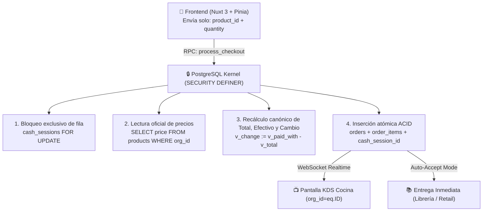

# AvivaCheck POS — Enterprise Multi-Tenant Point of Sale & Kitchen Display System

[](https://nuxt.com/)
[](https://supabase.com/)
[](https://www.postgresql.org/docs/current/ddl-rowsecurity.html)
[](https://playwright.dev/)

**AvivaCheck POS** es una plataforma transaccional de punto de venta (POS) y visualización de comandas en cocina (KDS) diseñada para congregaciones, iglesias y organizaciones multi-departamentales. 

Construida bajo un modelo **Zero-Trust Financial**, la plataforma traslada toda la autoridad de precios, totales, sesiones de caja y control de acceso a procedimientos almacenados en **PostgreSQL 15**, blindando el sistema contra condiciones de carrera, manipulación de cliente y secuestro de datos (*tenant hijacking*).

---

## 🏛️ Arquitectura y Blindajes Transaccionales (P1–P4)



### 1. Atomicidad en Checkout (`process_checkout` RPC)
* **Cero escrituras fragmentadas:** Toda venta se procesa en una única transacción en PostgreSQL dentro de la función PL/pgSQL `public.process_checkout`.
* **Serialización de Caja:** Bloqueo exclusivo de fila `SELECT * FROM cash_sessions WHERE id = v_session_id FOR UPDATE`, impidiendo colisiones entre cajeros y garantizando que una venta jamás quede huérfana o desvinculada de su turno.

### 2. Zero-Trust Pricing (Autoridad Exclusiva de Servidor)
* El cliente web **únicamente propone IDs de producto y cantidades**. El backend ignora cualquier precio, subtotal o total enviado por el navegador y consulta la tabla `products` activa bajo el contexto del tenant.
* **Cálculo de Efectivo y Cambio:** El servidor liquida y persiste canónicamente:
  - `change = paid_with - total`
  - Para pagos con tarjeta o transferencia, se fija automáticamente `paid_with = total` y `change = 0`.

### 3. Aislamiento Multi-Tenant & Departamental
* **Seguridad Nativa a Nivel de Fila (RLS):** Cada consulta en PostgreSQL está resguardada por políticas RLS vinculadas a `auth.uid()` y jerarquía organizacional.
* **Separación de Departamentos:** Permite la coexistencia aislada de múltiples áreas dentro de la misma organización (ej. *Cafetería* con despacho en cocina vs. *Librería* con auto-entrega).

### 4. Canales de Cocina Realtime Seguros
* Las pantallas de cocina (KDS) se suscriben al canal `kds:orders:${orgId}` con filtros estrictos de evento `INSERT on orders` donde `org_id=eq.ID`, evitando fugas de comandas entre iglesias u organizaciones distintas.

---

## 👥 Jerarquía de Roles y Flujos Operativos

| Rol | Nivel | Responsabilidades y Permisos |
| :--- | :---: | :--- |
| **Pastor / Admin** | Nivel 1 | Dueño de Organización. Registro inicial (`setup_new_tenant`), reportes financieros globales y alta de departamentos. |
| **Líder Depto.** | Nivel 2 | Administración del catálogo de productos y precios, alta de cajeros/cocina, supervisión de cajas y **Pre-Cierre de Contingencia**. |
| **Cajero (POS)** | Nivel 3 | Apertura de turno (`shared` o `independent`), cobro táctil con emisión de tickets y **Corte de Caja Final**. |
| **Cocina (KDS)** | Nivel 3 | Despacho de comandas en tiempo real clasificados por tiempo de espera con avance a `completed` o rechazo por falta de insumos. |

---

## 📁 Estructura del Repositorio

```text
avivamiento-webpage/
├── app/
│   ├── pages/
│   │   ├── login.vue                    # Autenticación Supabase
│   │   ├── signup.vue                   # Registro de Iglesia y Onboarding
│   │   └── page/POS/
│   │       ├── pointOfSales.vue         # Terminal de ventas táctil
│   │       ├── cashClosing.vue          # Arqueo, corte y contingencias de caja
│   │       ├── kds.vue                  # Pantalla de cocina en tiempo real
│   │       ├── products.vue             # Catálogo y precios Zero-Trust
│   │       └── users.vue                # Gestión de personal y roles
│   ├── stores/
│   │   ├── auth.ts                      # Sesión, perfil y reintentos de tenant
│   │   └── pos.ts                       # Carrito, normalizador de errores ACV_* y RPCs
│   └── types/                           # Modelos TypeScript del dominio
├── supabase/
│   ├── migrations/                      # 14 Migraciones SQL inmutables y versionadas
│   │   ├── 20260405014046_remote_schema.sql
│   │   ├── 20260507_rls_hardening_and_process_checkout.sql
│   │   ├── 20260602000100_cash_sessions_mvp.sql
│   │   └── 20260901000100_financial_invariants_and_error_contract.sql
│   └── config.toml                      # Configuración local de Supabase
├── tests/
│   └── operational-chaos/               # Suite de Resiliencia e Ingeniería de Caos
│       ├── final-chaos-journey.spec.ts  # Estrés con 9 navegadores simultáneos
│       ├── multi-viewport-journey.spec.ts # Pruebas en Móvil (375px), Tablet y Desktop
│       └── assertions.ts                # Aserciones de invariantes y reconciliación
└── docs/
    ├── portal/                          # Portal interactivo de documentación viva
    │   ├── index.html                   # Manual interactivo con reproductor Canvas 60 FPS
    │   └── assets/frames/               # 1,440 fotogramas HD de grabaciones Playwright
    └── PRODUCT.md                       # Especificación funcional y de negocio
```

---

## 🚦 Catálogo Canónico de Errores (`ACV_*`)

Para prevenir la filtración de trazas internas de PostgreSQL hacia la interfaz de usuario, las funciones `SECURITY DEFINER` emiten códigos de error estructurados que el frontend normaliza:

* `ACV_CHECKOUT_CASH_SESSION_NOT_OPEN`: Intento de cobro sobre una caja cerrada o en validación.
* `ACV_CHECKOUT_CASH_INSUFFICIENT`: Efectivo recibido menor al total recalculado por el servidor.
* `ACV_CHECKOUT_PRODUCT_UNAVAILABLE`: Producto inactivo o no perteneciente al departamento.
* `ACV_CHECKOUT_FORBIDDEN`: Perfil sin autorización para procesar cobros.
* `ACV_TENANT_SLUG_TAKEN`: Conflicto de identificador en el alta de organización.
* `ACV_TENANT_PROFILE_ALREADY_ASSIGNED`: Intento de escalada o re-asignación sobre un perfil existente.

---

## 🛠️ Instalación y Desarrollo Local

### Prerrequisitos
* **Node.js:** Versión 18.x o 20.x LTS
* **Supabase CLI:** (Opcional, para ejecución de entorno PostgreSQL local)

### Pasos de Configuración

1. **Clonar el repositorio:**
   ```bash
   git clone https://github.com/AproachingDark1889/avivamiento-webpage.git
   cd avivamiento-webpage
   ```

2. **Instalar dependencias:**
   ```bash
   npm install
   ```

3. **Variables de Entorno (`.env`):**
   Crea un archivo `.env` en la raíz del proyecto:
   ```ini
   SUPABASE_URL=https://tu-proyecto.supabase.co
   SUPABASE_KEY=tu-anon-key-publica
   ```

4. **Iniciar servidor de desarrollo:**
   ```bash
   npm run dev
   ```
   La aplicación estará disponible en `http://localhost:3002` (o `:3000`).

---

## 🧪 Ejecución de Pruebas de Caos (Playwright)

La suite de pruebas simula escenarios adversos reales (desconexión de cajeros, competencia por la misma caja compartida, pre-cierre en caliente y aislamiento Alpha/Beta):

```bash
# Ejecutar suite de caos completa
npx playwright test tests/operational-chaos/final-chaos-journey.spec.ts

# Ejecutar suite responsiva multi-viewport
npx playwright test tests/operational-chaos/multi-viewport-journey.spec.ts
```

---

## 📖 Portal de Documentación Interactiva

El repositorio incluye un portal de inducción visual para usuarios finales y auditores en [`docs/portal/index.html`](docs/portal/index.html), impulsado por un motor Canvas de 60 FPS con 1,440 fotogramas continuos capturados de las pruebas E2E, selector de 5 velocidades (`0.25x` a `2.0x`) y capítulos interactivos 1-2-3.
