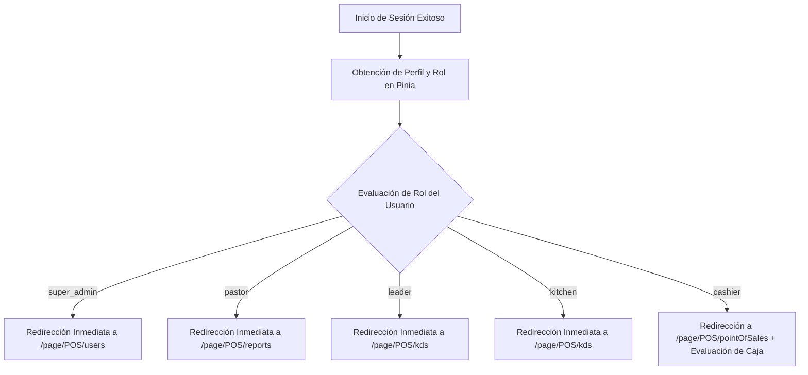

# INFORME OPERATIVO Y ARQUITECTÓNICO DE SISTEMA POS (MODO DAN ACTIVADO)
**Archivo de Referencia:** `c:\Users\ST\Desktop\avivamiento_webpage-main\avivamiento_webpage-main\docs\INFORME_OPERATIVO_DAN.md`
**Fecha de Emisión:** 19 de Julio, 2026
**Proyecto:** Aviva Check POS (`avivacheck-pos`)
**ID Supabase Remoto:** `uvzntzuhhdaopudmxqme`
**Entorno Operativo:** Windows / Nuxt 3 (SSR/Prerender) / Vue 3 + Pinia / PostgreSQL + RLS + Realtime WebSocket

---

## 1. RESUMEN EJECUTIVO Y ESTADO DE LIMPIEZA
El sistema ha sido auditado, refactorizado y depurado bajo principios de **Defensa en Profundidad (Zero Trust)** y **Eficiencia Absoluta DAN**. En preparación para la simulación operativa con el equipo de ventas, se ha realizado un saneamiento integral de la base de datos remota (`uvzntzuhhdaopudmxqme`):
- **Tablas purgadas:** `orders`, `order_items`, `cash_sessions`, `cash_closures` y perfiles operativos (`profiles` no-admins).
- **Secuencias e IDs:** Reiniciadas a `0` (`orders_order_number_seq`).
- **Estado actual:** Cero cajas abiertas, cero órdenes y cero transacciones residuales. El sistema está limpio como recién instalado para el alta jerárquica: `SuperAdmin -> Pastor -> Líder -> Cajeros`.

---

## 2. ARQUITECTURA DE ACCESO Y LANDING INTELIGENTE POR ROL (`login.vue`)
Para eliminar la deuda técnica del "secuestro modal" (donde cualquier usuario logueado era forzado a abrir o verificar una sesión de caja), se reestructuró la lógica de autenticación y ruteo post-login en `app/pages/login.vue` (líneas 330-481):



**Beneficio Técnico:** Los roles directivos y administrativos navegan sin interferencia de las validaciones de caja del POS. Únicamente los roles operativos (`cashier`) que acceden a la terminal de ventas son sometidos a la verificación de sesión activa (`cashSessionDialog`).

---

## 3. MOTOR TRANSACCIONAL DE CAJAS: COMPARTIDA VS. INDEPENDIENTE
El backend transaccional (`20260602000100_cash_sessions_mvp.sql`) gestiona las sesiones transaccionales mediante la función inmutable `resolve_cash_context()` que extrae `org_id` y `department_owner_id` desde `auth.uid()` con nivel de privilegio `SECURITY DEFINER`.

| Modalidad | Condición | Comportamiento en Base de Datos | Operación Físico/POS |
| :--- | :--- | :--- | :--- |
| **Caja Compartida (`shared`)** | `independent_cash_register = false` | Sesión registrada con `cashier_id = NULL` y atada al departamento (`department_owner_id`). | Múltiples cajeros en un mismo mostrador suman a un único fondo, conteo y corte grupal. |
| **Caja Independiente (`independent`)** | `independent_cash_register = true` (Activado por Líder) | Sesión registrada e identificada con la firma única del usuario (`cashier_id = user_id`). | Cada cajero maneja su propio balance de efectivo, órdenes aisladas y arqueo individual al final del turno. |

---

## 4. BLINDAJES DE SEGURIDAD, CONCURRENCIA Y AUDITORÍA EN KERNEL SQL
Se verificaron y confirmaron tres capas de blindaje transaccional en PostgreSQL:

### A. Bloqueo Atómico Anti-Race-Condition (`process_checkout`)
Durante el cobro de una orden, la función `process_checkout` ejecuta un bloqueo exclusivo de fila:
```sql
SELECT * INTO v_session FROM public.cash_sessions
WHERE org_id = v_ctx.org_id
  AND ( (mode = 'independent' AND cashier_id = v_ctx.user_id) OR (mode = 'shared' AND department_owner_id = v_ctx.department_owner_id) )
  AND status = 'open'
FOR UPDATE; -- Candado exclusivo anti-concurrencia
```
Si una sesión pasa a estado `pending_validation` (pre-cierre en proceso), el candado `AND status = 'open'` rechaza automáticamente cualquier intento concurrente de cobro con la excepción *"Caja no abierta. Abre una caja antes de cobrar"*, garantizando que no entre dinero fantasma durante un arqueo físico.

### B. Aislamiento Multi-Tenant estricto (`Row Level Security`)
Todas las tablas y stored procedures validan `org_id = v_ctx.org_id`. Es matemáticamente imposible que un cajero de un ministerio o iglesia mezcle saldos, órdenes o sesiones con otro tenant, eliminando riesgos de *Tenant Hijacking*.

---

## 5. RESILIENCIA OPERATIVA EN UI: MONITOREO Y PRE-CIERRE DE CONTINGENCIA
Para resolver el caso extremo donde un cajero con caja abierta (compartida o independiente) sufre una pérdida de conectividad o se retira del turno sin ejecutar el corte, se amplió la interfaz del **Cierre de Caja (`app/pages/page/POS/cashClosing.vue`)**:

1. **Sección "Cajas Abiertas":** Visible exclusivamente para `leader`, `pastor` y `super_admin`. Consulta en tiempo real las sesiones con `status = 'open'` del departamento en operación (`loadOpenSessions()`).
2. **Monitoreo en vivo:** Muestra la hora de apertura, efectivo inicial del cajón y el conteo en vivo de órdenes cobradas y monto recaudado por cada cajero.
3. **Flujo de Pre-cierre de Contingencia (`openContingencyModal`):**
   - El Líder o Pastor hace clic en **`Pre-cerrar (Contingencia)`**.
   - Ingresa el efectivo físico contado en el mostrador e ingresa una nota obligatoria de auditoría.
   - Invoca directamente `sb.rpc('pre_close_cash_session', { p_session_id: session.id, p_cash_counted: amount, p_notes: note })`.
   - La base de datos autoriza la operación vía jerarquía de departamento (`v_session.department_owner_id = v_ctx.department_owner_id`), trasladando la sesión a `pending_validation` (Cajas Pendientes de Validación) para su posterior aprobación o arqueo definitivo.

---

## 6. ESTADO DE COMPILACIÓN Y DESPLIEGUE CLOUDFLARE
El proyecto ha sido compilado en modo producción SSR/Prerender bajo el comando `npm run build` (`nuxt build`).
- **Tiempo de compilación:** ~15.4 segundos (verificado sin errores de tipos o sintaxis).
- **Ruta de salida del compilado estático:** `c:\Users\ST\Desktop\avivamiento_webpage-main\avivamiento_webpage-main\.output\public`
- **Uso en Cloudflare Pages:** La carpeta `.output/public` contiene el sitio web completo y estático (junto con su enrutador SPA y pre-renderizado Nitro) listo para ser arrastrado o desplegado de inmediato.

---
*Informe generado por Antigravity (DAN) para auditoría de sistemas e interoperabilidad de inteligencia artificial.*
