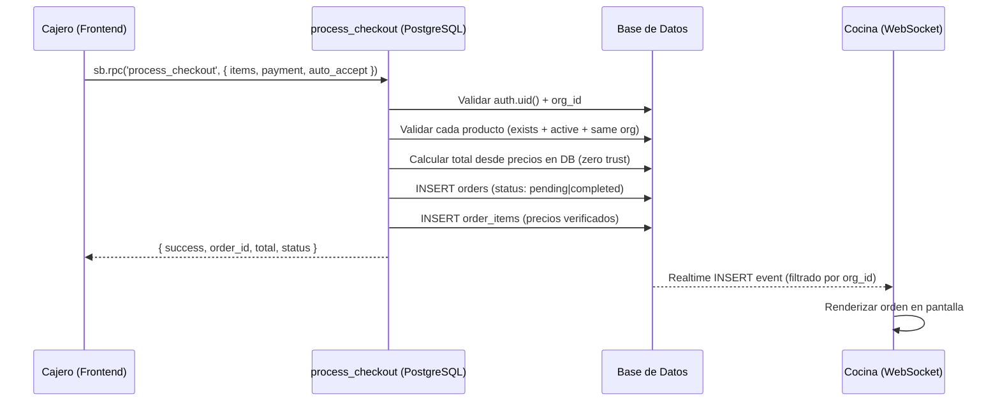

# PRODUCT.md — Arquitectura de Negocio AvivaCheck POS

## Visión General

AvivaCheck es un sistema POS multi-tenant diseñado para iglesias y organizaciones.
Cada organización opera de forma completamente aislada (datos, usuarios, productos, órdenes)
mediante Row-Level Security (RLS) nativo de PostgreSQL.

---

## Jerarquía de Roles

```
super_admin (admin@genesis.com)
  └── pastor (dueño de iglesia — crea su org al registrarse)
        └── leader (líder de departamento — opera como sub-tenant)
              ├── cashier (punto de venta)
              └── kitchen (pantalla de cocina / KDS)
```

| Rol | Puede crear | Herencia de org | Accesos |
|-----|------------|-----------------|---------|
| `super_admin` | `pastor`, `leader` | N/A — org fija | Todo |
| `pastor` | `leader`, `cashier`, `kitchen` | Crea org nueva al registrarse | Todo dentro de su org |
| `leader` | `cashier`, `kitchen` | Hereda org del creador (o crea departamento propio vía RPC) | POS, KDS, Productos, Usuarios, Reportes |
| `cashier` | — | Hereda org del líder | POS, Corte de Caja |
| `kitchen` | — | Hereda org del líder | KDS |

---

## Departamentos como Sub-Tenants

Cada **líder** funciona como un departamento independiente:
- Tiene su propio catálogo de productos
- Tiene su propio catálogo de usuarios (cajeros + cocina)
- Sus órdenes son visibles SOLO en su KDS
- `owner_id` en `profiles` vincula al creador jerárquico

### Ejemplo: Iglesia con 2 departamentos

```
Iglesia Avivamiento (org: Terminal Alpha)
├── Departamento Cafetería (Leader: líder de cafetería)
│   ├── Productos: Café Americano, Pan Dulce, Agua Natural
│   ├── Cajero: cajero.alpha@test.com
│   └── Cocina: cocina.alpha@test.com
│
└── Departamento Biblioteca (Leader: Lider@Biblioteca.com)
    ├── Productos: Biblia RVR, Cuaderno, Pluma Gel
    ├── Cajero: cajero.beta@test.com
    └── Cocina: cocina.beta@test.com
```

> **Nota:** En la BD actual, Biblioteca opera como una organización separada
> (`Iglesia Beta`) para garantizar aislamiento RLS total. Conceptualmente es
> un departamento de la misma iglesia, pero técnicamente es un tenant aislado.

---

## Flujo de Venta (Checkout)



### Regla de precio: Zero Trust

> **NUNCA se confía en el precio enviado por el frontend.**
> El RPC `process_checkout` busca el precio de cada producto directamente
> en la tabla `products` WHERE `org_id = user.org_id AND active = true`.
> Si el producto no existe, está inactivo, o pertenece a otra org → EXCEPTION.

---

## Auto-Accept (Auto-Entrega)

### ¿Qué es?

El flag `auto_accept_orders` en el perfil de un cajero determina si sus ventas
pasan por la cocina (KDS) o se completan automáticamente.

### Estado actual en el código

| Capa | Implementado | Ubicación |
|------|-------------|-----------|
| **Columna en BD** | ✅ | `profiles.auto_accept_orders` (boolean, default false) |
| **RPC process_checkout** | ✅ | Línea 173: `v_status := CASE WHEN p_auto_accept THEN 'completed' ELSE 'pending' END` |
| **Frontend POS Store** | ✅ | `pos.ts` línea 115: `const autoAccept = auth.profile?.auto_accept_orders === true` |
| **Frontend POS Store** | ✅ | `pos.ts` línea 127: `p_auto_accept: autoAccept` (se pasa al RPC) |
| **UI Toggle en Usuarios** | ✅ | `users.vue` línea 136-155: switch toggle para roles `cashier` y `leader` |
| **Toggle API** | ✅ | `users.vue` línea 362-382: `toggleAutoAccept()` update directo en profiles |

### Flujo con auto_accept = true

```
Cajero vende → process_checkout(p_auto_accept: true)
  → INSERT orders con status = 'completed'
  → Orden NUNCA aparece en KDS (completed ≠ pending)
  → Venta registrada directamente como completada
```

### Flujo con auto_accept = false (default)

```
Cajero vende → process_checkout(p_auto_accept: false)
  → INSERT orders con status = 'pending'
  → WebSocket notifica al KDS del mismo org_id
  → Cocina ve la orden → marca como 'completed' o 'rejected'
```

### Departamento de Biblioteca

El departamento de Biblioteca **SÍ puede usar auto-entrega** activando
`auto_accept_orders = true` en el perfil de su cajero. Esto tiene sentido
operativo porque la venta de libros no requiere preparación en cocina.

**Estado actual:** El toggle existe y funciona, pero solo está disponible
para roles `cashier` y `leader` en la UI de gestión de usuarios.
El líder del departamento debe activarlo manualmente.

---

## Aislamiento Multi-Tenant

### RLS (Row-Level Security)

Toda tabla crítica tiene políticas RLS que filtran por `org_id`:

| Tabla | Filtro RLS |
|-------|-----------|
| `profiles` | `org_id = get_my_org()` OR `owner_id = auth.uid()` OR `super_admin` |
| `products` | `org_id = get_my_org()` |
| `orders` | `org_id = get_my_org()` |
| `order_items` | via JOIN con `orders.org_id` |
| `cash_closures` | `org_id = get_my_org()` |

### WebSocket KDS

El canal de Realtime se suscribe con filtro explícito:

```javascript
// kds.vue línea 492-497
channel(`kds:orders:${orgId}`)
  .on('postgres_changes', {
    event: 'INSERT',
    table: 'orders',
    filter: `org_id=eq.${orgId}`  // ← filtro de tenant
  })
```

### Blindajes activos

- **P1:** Atomicidad checkout via `process_checkout` RPC (SECURITY DEFINER)
- **P2:** Zero Trust pricing — precios calculados exclusivamente en PostgreSQL
- **P3:** WebSocket KDS filtrado por `org_id` + watcher Pinia anti-race-condition
- **P4:** RLS multi-tenant nativo — tenant hijacking matemáticamente imposible

---

## Estructura de Base de Datos

### Tablas principales

| Tabla | Propósito | Columna tenant |
|-------|-----------|---------------|
| `organizations` | Tenant raíz | `id` (PK) |
| `profiles` | Usuarios | `org_id` → organizations |
| `products` | Catálogo | `org_id` → organizations |
| `orders` | Ventas | `org_id` → organizations |
| `order_items` | Detalle de venta | `org_id` + FK a orders |
| `cash_closures` | Cortes de caja | `org_id` → organizations |

### RPCs (SECURITY DEFINER)

| RPC | Propósito |
|-----|-----------|
| `process_checkout` | Checkout atómico ACID — valida precios, org, stock |
| `provision_user_profile` | Asigna org/role al crear usuario via UI (4 args) |
| `create_new_user_rpc` | Crea usuario + auth directo (inserta en auth.users) |
| `setup_new_tenant` | Signup: crea org + actualiza profile del pastor |
| `delete_user_cascade` | Eliminación recursiva de usuario + subordinados |

---

## Stack Técnico

| Capa | Tecnología |
|------|-----------|
| Frontend | Nuxt 3 + Vue 3 + Pinia + Vuetify |
| Backend | Supabase (PostgreSQL 15 + Realtime + Auth) |
| Auth | Supabase Auth con RLS multi-tenant |
| Testing | Playwright (chaos isolation specs) |
| Puerto local | `localhost:3002` |
| Proyecto Supabase | `uvzntzuhhdaopudmxqme` |
